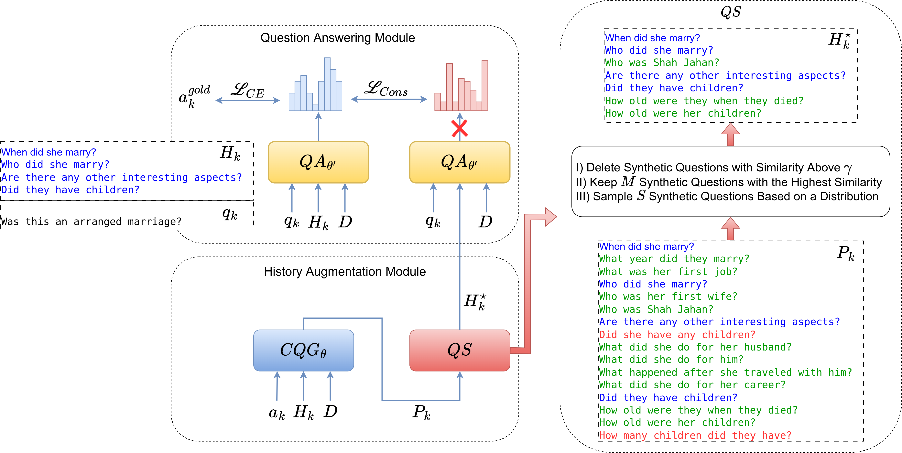

### Consistency Training by Synthetic Question Generation for Conversational Question Answering

This code presents the method for our paper, which is submitted to NAACL 2024. The architecture of the model is presented in the below image.

 

In the below table, the results are presented:

| Model Name                    | F1   | HEQ-Q | HEQ-D | Unrealistic Setting |
| ----------------------------- | ---- | ----- | ----- | -------------------- |
| Bert-HAE-Real [1]              | 53.5 | -     | -     |                      |
| HAM-Real [1]                   | 54.2 | -     | -     |                      |
| Bert                          | 58.9 | 52.9  | 5.3   |                      |
| CoTaH-Bert                    | 60.5 | 54.8  | 5.1   |                      |
| Bert-HAE [2]                  | 62.4 | 57.8  | 5.1   | 
:heavy_check_mark: <\center>  |
| HAM [3]                       | 64.4 | 60.2  | 6.1   | :heavy_check_mark:   |
| Reinforced Backtracking [4]   | 66.1 | 62.2  | 7.3   | :heavy_check_mark:   |

